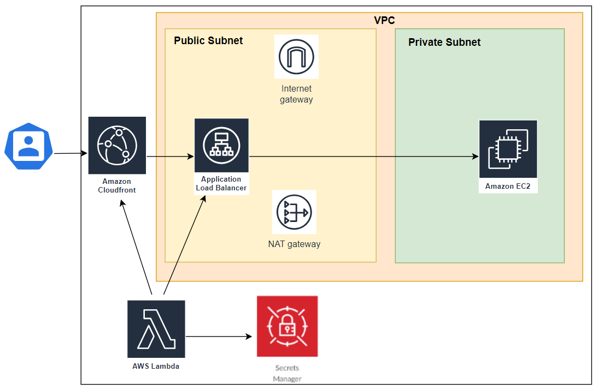

# Adding Custom Headers with Auto-rotation to allow traffic to ALB via CloudFront only

## Architecture
<kbd>
  
</kbd>

## Developer
Janarthanan Kugathasan

## Method
```terraform
#To create
terraform init
terraform plan
terraform apply -auto-approve

#To destroy
terraform destroy -auto-approve
```
